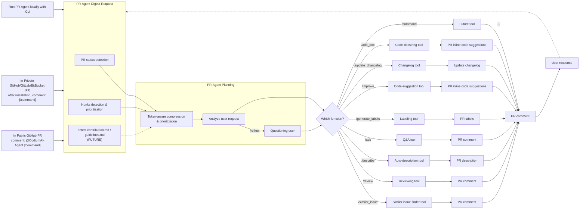

> ## 🔱 Fork notice
>
> This is a community **fork of [qodo-ai/pr-agent](https://github.com/qodo-ai/pr-agent)** (Apache-2.0).
> It is **not** affiliated with or endorsed by Qodo — all credit for the original project
> goes to its authors and contributors.
>
> **What this fork adds:** a **CLI/OAuth AI handler** so PR review runs on your
> **chat/CLI subscription** (Claude Max via the `claude` CLI, ChatGPT Pro via the `codex` CLI)
> instead of an **API key** — useful when you only have a subscription (no pay-per-token API
> quota) or hit the GitHub Copilot review quota.
>
> See **[`CHANGES.md`](CHANGES.md)** for the full list of fork changes and
> **[`docs/oauth-cli-mode.md`](docs/oauth-cli-mode.md)** for usage.
> The original upstream README follows below, unchanged.

---


<br />

<div align="center">


<picture>
  <source media="(prefers-color-scheme: dark)" srcset="https://codium.ai/images/pr_agent/logo-dark.png" width="330">
  <source media="(prefers-color-scheme: light)" srcset="https://codium.ai/images/pr_agent/logo-light.png" width="330">
  

</picture>
<br>
The Original Open-Source PR Reviewer
<br><br>
<a href="https://github.com/the-pr-agent/pr-agent/commits/main">

</a>
</div>

---

 This repository contains the open-source PR Agent Project. 
 It is not the Qodo free tier.
 
Try the free version on our website.

👉[Get Started Now](https://www.qodo.ai/get-started/)

PR-Agent is an open-source, AI-powered code review agent and a community-maintained legacy project of Qodo. It is distinct from Qodo’s primary AI code review offering, which provides a feature-rich, context-aware experience. Qodo now offers a free tier that integrates seamlessly with GitHub, GitLab, Bitbucket, and Azure DevOps for high-quality automated reviews.


## Big News for PR-Agent

PR-Agent has a new home!

After years of building this tool alongside the community, Qodo has donated PR-Agent to the open-source community - and we couldn't be more excited about what comes next.

The project now lives in the PR-Agent org on GitHub, is fully community-owned, and is open for contributions and additional maintainers.

What else changed: 
- Docs moved to - www.pr-agent.ai
- Qodo Merge (Qodo 1.0), the hosted URL, which was the enterprise version of PR-Agent, has been rebranded and evolved into Qodo (Qodo 2.0), a full AI code review platform.


## Table of Contents

- [Getting Started](#getting-started)
- [Why Use PR-Agent?](#why-use-pr-agent)
- [Features](#features)
- [See It in Action](#see-it-in-action)
- [How It Works](#how-it-works)
- [Data Privacy](#data-privacy)
- [Contributing](#contributing)

## Getting Started

> [!NOTE]
> **Docker Hub namespace migration.** Releases `0.34.2` and later are published under [`pragent/pr-agent`](https://hub.docker.com/r/pragent/pr-agent). Older releases (up to and including `v0.31`) remain available at the legacy [`codiumai/pr-agent`](https://hub.docker.com/r/codiumai/pr-agent) namespace as a frozen archive — no new images are pushed there. Update any pinned `image:` / `docker pull` / `uses: docker://` references when upgrading to `0.34.2+`.

### 🚀 Quick Start for PR-Agent

#### 1. GitHub Action (Recommended)

Add automated PR reviews to your repository with a simple workflow file:

```yaml
# .github/workflows/pr-agent.yml
name: PR Agent
on:
  pull_request:
    types: [opened, synchronize]
jobs:
  pr_agent_job:
    runs-on: ubuntu-latest
    steps:
    - name: PR Agent action step
      uses: the-pr-agent/pr-agent@main
      env:
        OPENAI_KEY: ${{ secrets.OPENAI_KEY }}
        GITHUB_TOKEN: ${{ secrets.GITHUB_TOKEN }}
```
[Full GitHub Action setup guide](https://docs.pr-agent.ai/installation/github/#run-as-a-github-action)

#### 2. CLI Usage (Local Development)

Run PR-Agent locally on your repository:
```bash
pip install pr-agent
export OPENAI_KEY=your_key_here
pr-agent --pr_url https://github.com/owner/repo/pull/123 review
```
[Complete CLI setup guide](https://docs.pr-agent.ai/usage-guide/automations_and_usage/#local-repo-cli)

#### 3. Other Platforms

- [GitLab webhook setup](https://docs.pr-agent.ai/installation/gitlab/)
- [BitBucket app installation](https://docs.pr-agent.ai/installation/bitbucket/)
- [Azure DevOps setup](https://docs.pr-agent.ai/installation/azure/)

[//]: # (## News and Updates)

[//]: # ()
[//]: # (## Aug 8, 2025)

[//]: # ()
[//]: # ()
[//]: # ()
[//]: # (## Jul 1, 2025)

[//]: # (You can now receive automatic feedback from Qodo Merge in your local IDE after each commit. Read more about it [here]&#40;https://github.com/qodo-ai/agents/tree/main/agents/qodo-merge-post-commit&#41;.)

[//]: # ()
[//]: # ()
[//]: # (## Jun 21, 2025)

[//]: # ()
[//]: # (v0.30 was [released]&#40;https://github.com/the-pr-agent/pr-agent/releases&#41;)

[//]: # ()
[//]: # ()
[//]: # (## Apr 30, 2025)

[//]: # ()
[//]: # (A new feature is now available in the `/improve` tool for Qodo Merge 💎 - Chat on code suggestions.)

[//]: # ()
[//]: # ()

[//]: # ()
[//]: # (Read more about it [here]&#40;https://docs.pr-agent.ai/tools/improve/#chat-on-code-suggestions&#41;.)

[//]: # ()
[//]: # ()

## Why Use PR-Agent?

### 🎯 Built for Real Development Teams

**Fast & Affordable**: Each tool (`/review`, `/improve`, `/ask`) uses a single LLM call (~30 seconds, low cost)

**Handles Any PR Size**: Our [PR Compression strategy](https://docs.pr-agent.ai/core-abilities/#pr-compression-strategy) effectively processes both small and large PRs

**Highly Customizable**: JSON-based prompting allows easy customization of review categories and behavior via [configuration files](pr_agent/settings/configuration.toml)

**Platform Agnostic**: 
- **Git Providers**: GitHub, GitLab, BitBucket, Azure DevOps, Gitea
- **Deployment**: CLI, GitHub Actions, Docker, self-hosted, webhooks
- **AI Models**: OpenAI GPT, Claude, Deepseek, and more

**Open Source Benefits**:
- Full control over your data and infrastructure
- Customize prompts and behavior for your team's needs
- No vendor lock-in
- Community-driven development

## Features

<div style="text-align:left;">

PR-Agent offers comprehensive pull request functionalities integrated with various git providers:

|                                                         |                                                                                        | GitHub | GitLab | Bitbucket | Azure DevOps | Gitea |
|---------------------------------------------------------|----------------------------------------------------------------------------------------|:------:|:------:|:---------:|:------------:|:-----:|
| [TOOLS](https://docs.pr-agent.ai/tools/)         | [Describe](https://docs.pr-agent.ai/tools/describe/)                            |   ✅   |   ✅   |    ✅     |      ✅      |  ✅   |
|                                                         | [Review](https://docs.pr-agent.ai/tools/review/)                                |   ✅   |   ✅   |    ✅     |      ✅      |  ✅   |
|                                                         | [Improve](https://docs.pr-agent.ai/tools/improve/)                              |   ✅   |   ✅   |    ✅     |      ✅      |  ✅   |
|                                                         | [Ask](https://docs.pr-agent.ai/tools/ask/)                                      |   ✅   |   ✅   |    ✅     |      ✅      |       |
|                                                         | ⮑ [Ask on code lines](https://docs.pr-agent.ai/tools/ask/#ask-lines)            |   ✅   |   ✅   |           |              |       |
|                                                         | [Help Docs](https://docs.pr-agent.ai/tools/help_docs/?h=auto#auto-approval)     |   ✅   |   ✅   |    ✅     |              |       |
|                                                         | [Update CHANGELOG](https://docs.pr-agent.ai/tools/update_changelog/)            |   ✅   |   ✅   |    ✅     |      ✅      |       |
|                                                         |                                                                                                                     |        |        |           |              |       |
| [USAGE](https://docs.pr-agent.ai/usage-guide/)   | [CLI](https://docs.pr-agent.ai/usage-guide/automations_and_usage/#local-repo-cli)                            |   ✅   |   ✅   |    ✅     |      ✅      |  ✅   |
|                                                         | [App / webhook](https://docs.pr-agent.ai/usage-guide/automations_and_usage/#github-app)                      |   ✅   |   ✅   |    ✅     |      ✅      |  ✅   |
|                                                         | [Tagging bot](https://github.com/the-pr-agent/pr-agent#try-it-now)                                                     |   ✅   |        |           |              |       |
|                                                         | [Actions](https://docs.pr-agent.ai/installation/github/#run-as-a-github-action)                              |   ✅   |   ✅   |    ✅     |      ✅      |       |
|                                                         |                                                                                                                     |        |        |           |              |       |
| [CORE](https://docs.pr-agent.ai/core-abilities/) | [Adaptive and token-aware file patch fitting](https://docs.pr-agent.ai/core-abilities/compression_strategy/) |   ✅   |   ✅   |    ✅     |      ✅      |       |
|                                                         | [Dynamic context](https://docs.pr-agent.ai/core-abilities/dynamic_context/)                                  |   ✅   |   ✅   |    ✅     |      ✅      |       |
|                                                         | [Fetching ticket context](https://docs.pr-agent.ai/core-abilities/fetching_ticket_context/)                  |   ✅    |  ✅    |     ✅     |              |       |
|                                                         | [Interactivity](https://docs.pr-agent.ai/core-abilities/interactivity/)                                      |   ✅   |  ✅   |           |              |       |
|                                                         | [Local and global metadata](https://docs.pr-agent.ai/core-abilities/metadata/)                               |   ✅   |   ✅   |    ✅     |      ✅      |       |
|                                                         | [Multiple models support](https://docs.pr-agent.ai/usage-guide/changing_a_model/)                            |   ✅   |   ✅   |    ✅     |      ✅      |       |
|                                                         | [PR compression](https://docs.pr-agent.ai/core-abilities/compression_strategy/)                              |   ✅   |   ✅   |    ✅     |      ✅      |       |
|                                                         | [Self reflection](https://docs.pr-agent.ai/core-abilities/self_reflection/)                                  |   ✅   |   ✅   |    ✅     |      ✅      |       |

[//]: # (- Support for additional git providers is described in [here]&#40;./docs/Full_environments.md&#41;)
___

## See It in Action

</div>
<h4><a href="https://github.com/the-pr-agent/pr-agent/pull/530">/describe</a></h4>
<div align="center">
<p float="center">

</p>
</div>
<hr>

<h4><a href="https://github.com/the-pr-agent/pr-agent/pull/732#issuecomment-1975099151">/review</a></h4>
<div align="center">
<p float="center">
<kbd>

</kbd>
</p>
</div>
<hr>

<h4><a href="https://github.com/the-pr-agent/pr-agent/pull/732#issuecomment-1975099159">/improve</a></h4>
<div align="center">
<p float="center">
<kbd>

</kbd>
</p>
</div>

<hr>

## How It Works

The diagram below is PR-Agent's flow — a versioned, faithful recreation of the
upstream "How It Works" figure. The AI steps (**PR-Agent Planning** and every
tool) run through a pluggable **AI handler**: that is the single seam where this
fork adds `ai_handler=cli` to run on a **chat/CLI subscription (OAuth)** instead
of an API key. For a step-by-step legend grounded in the code — and where the
handler plugs in — see **[How It Works — explained](docs/how-it-works-explained.md)**.



<sub>The original upstream diagram image lived at `qodo.ai/images/pr_agent/diagram-v0.9.png`; this fork replaces it with the versioned, faithful mermaid recreation above. The AI handler is not a node here — it is the LLM backend used inside **PR-Agent Planning** and every **tool**; see the explained doc for where `ai_handler=cli` (this fork) sits.</sub>

## Data Privacy

### Self-hosted PR-Agent

- If you host PR-Agent with your OpenAI API key, it is between you and OpenAI. You can read their API data privacy policy here:
https://openai.com/enterprise-privacy

## Contributing

To contribute to the project, get started by reading our [Contributing Guide](https://github.com/the-pr-agent/pr-agent/blob/b09eec265ef7d36c232063f76553efb6b53979ff/CONTRIBUTING.md).


## ❤️ Community

This open-source release remains here as a community contribution from Qodo — the origin of modern AI-powered code collaboration. We’re proud to share it and inspire developers worldwide.

The project now has its first external maintainer, Naor ([@naorpeled](https://github.com/naorpeled)), and is currently in the process of being donated to an open-source foundation.
