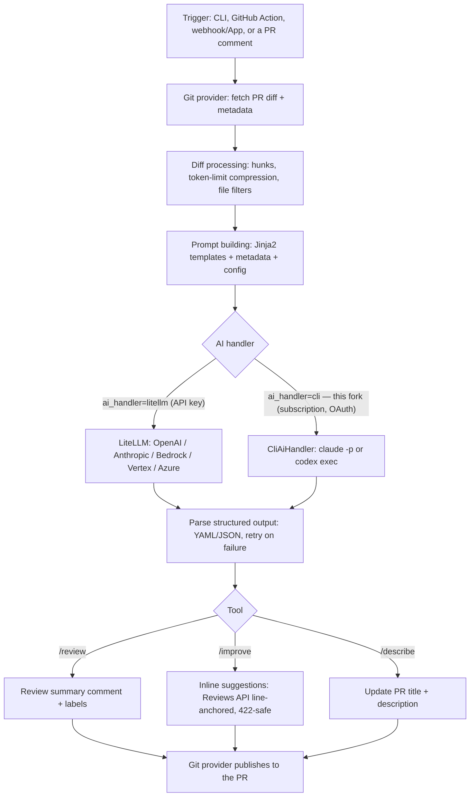

# How It Works — explained

The upstream README's "How It Works" section is just an image. This page is a
**code-grounded legend** of the same flow, and it highlights **where this fork's
CLI/OAuth subscription handler plugs in** (only one step changes).

## Step by step (grounded in the code)

1. **Trigger** — a PR command is started by the CLI (`pr_agent/cli.py` → `PRAgent.handle_request`), a GitHub Action (`pr_agent/servers/github_action_runner.py`), a webhook/App server (`pr_agent/servers/`), or a `/command` comment on the PR.
2. **Git provider — fetch** — `pr_agent/git_providers/github_provider.py` (and siblings for GitLab/Bitbucket/etc.) reads the PR **diff** and **metadata** (title, body, linked tickets/sub-issues). Auth: `github.user_token` (a PAT / `gh auth token`) or a GitHub App.
3. **Diff processing & compression** — `pr_agent/algo/pr_processing.py` (`get_pr_diff`) builds the diff representation in **hunks**, applies **file filters**, and **compresses** it when it exceeds the model's token budget. See `docs/docs/core-abilities/` (`compression_strategy`, `dynamic_context`).
4. **Prompt building** — the tool renders a **Jinja2 prompt** from `pr_agent/settings/*_prompts.toml`, injecting the diff, metadata, and config (e.g. `config.response_language` → the response language).
5. **AI handler** — `pr_agent/algo/ai_handlers/` implements `BaseAiHandler.chat_completion(...)`. Selected by `[config] ai_handler` (`PRAgent._resolve_ai_handler`):
   - **`litellm`** (default) — `litellm_ai_handler.py` → the provider **API** (OpenAI/Anthropic/Bedrock/Vertex/Azure) with an **API key**.
   - **`cli`** (this fork) — `cli_ai_handler.py` → drives a **subscription CLI** (`claude -p` / `codex exec`) over the subscription's **OAuth session**: no API key, no GitHub Copilot quota. See `docs/oauth-cli-mode.md`.
6. **Parse (with retry)** — `pr_agent/algo/utils.py` (`load_yaml`) parses the model's **structured** YAML/JSON output and **retries** on an initial parse failure. This matters for the `cli` handler, whose output lacks the API's `response_format` and is occasionally looser on the first try.
7. **Tool logic** — the specific tool shapes the result: `tools/pr_reviewer.py` (`/review`), `tools/pr_code_suggestions.py` (`/improve`), `tools/pr_description.py` (`/describe`), etc. See `docs/docs/tools/`.
8. **Publish** — the git provider posts the result back to the PR:
   - `/review` → a **summary comment** ("PR Reviewer Guide") + labels.
   - `/improve` → **inline, line-anchored** suggestions via the GitHub **Reviews API** when `pr_code_suggestions.commitable_code_suggestions=true` (this fork's default). The API rejects (HTTP 422) any comment whose line is **not inside a diff hunk**.
   - `/describe` → updates the PR **title + description**.

## Where this fork changes the picture

Only **step 5** (the AI handler). Everything else — fetch, compression, prompts,
parsing, tools, publishing — is upstream PR-Agent, reused unchanged. The fork adds
a provider that runs on a **chat/CLI subscription** instead of an API key, plus a
GitHub Action (`action.yml`) and a default of inline `/improve` suggestions.

## See also

- `docs/oauth-cli-mode.md` — the CLI/OAuth subscription handler (step 5).
- `docs/docs/core-abilities/` — compression, dynamic context, metadata, self-reflection (steps 3–4).
- `docs/docs/tools/` — per-tool docs (step 7).
- `CHANGES.md` — what this fork changed vs upstream.
