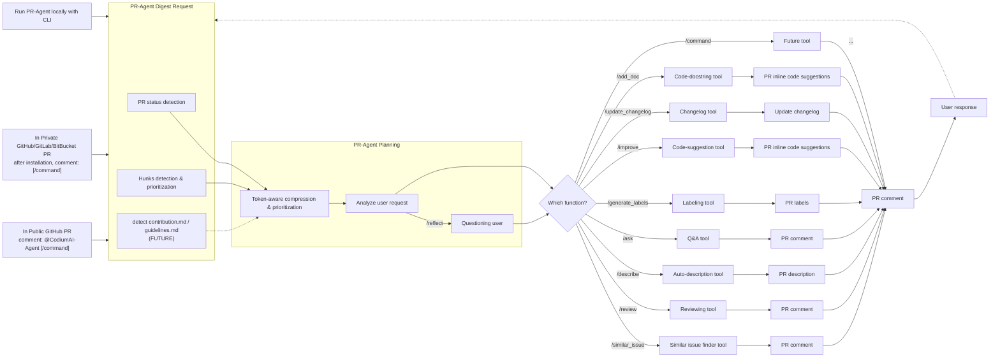

# How It Works — explained

The upstream README's "How It Works" section is just an image. This page is a
**code-grounded legend** of the same flow (the versioned mermaid in the README is
a faithful recreation of that figure), and it highlights **where this fork's
CLI/OAuth subscription handler plugs in**.

## Legend (grounded in the code)

### Trigger — `A1 / A2 / A3`

A command enters from one of three surfaces, all of which converge on
`PRAgent.handle_request` (`pr_agent/agent/pr_agent.py`):

- **`A1` public PR** — a `@CodiumAI-Agent /command` comment, handled by the
  webhook/App servers in `pr_agent/servers/`.
- **`A2` private PR** — the same `/command` comment after the App is installed on
  a GitHub / GitLab / Bitbucket repo (provider chosen in
  `pr_agent/git_providers/`).
- **`A3` local CLI** — `python -m pr_agent.cli --pr_url ... <command>`
  (`pr_agent/cli.py`), or this fork's GitHub Action entrypoint
  `pr_agent/servers/cli_action_runner.py`.

### `DIGEST` — PR-Agent Digest Request

Reads the PR and turns it into a model-ready representation. Implemented across
`pr_agent/git_providers/*` (fetch) and `pr_agent/algo/pr_processing.py` (diff):

- **`D1` PR status detection** — the git provider loads PR **metadata** (title,
  body, state, linked tickets/sub-issues). Auth is `github.user_token` (a PAT /
  `gh auth token`) or a GitHub App.
- **`D2` hunks detection & prioritization** — `get_pr_diff` builds the diff as
  **hunks** and applies file filters.
- **`D3` detect `contribution.md` / `guidelines.md` (FUTURE)** — dashed in the
  diagram: a planned step to pick up repo-level review guidelines.

### `PLAN` — PR-Agent Planning

Fits the request into the model's budget and decides what to do. Lives in
`pr_agent/algo/pr_processing.py` + the per-tool prompt under
`pr_agent/settings/*_prompts.toml`:

- **`P1` token-aware compression & prioritization** — when the diff exceeds the
  model's token budget it is **compressed** (see
  `docs/docs/core-abilities/` → `compression_strategy`, `dynamic_context`).
- **`P2` analyze user request** — the tool renders its **Jinja2 prompt**,
  injecting the diff, metadata, and config (e.g. `config.response_language` → the
  output language).
- **`P3` questioning user (`/reflect`)** — the self-reflection path: the model
  asks clarifying questions before acting.

> **★ Where this fork plugs in.** `PLAN` and every **tool** below make their LLM
> calls through `BaseAiHandler.chat_completion(...)`
> (`pr_agent/algo/ai_handlers/`), selected by `[config] ai_handler`
> (`PRAgent._resolve_ai_handler`):
>
> - **`litellm`** (default) — `litellm_ai_handler.py` → the provider **API**
>   (OpenAI / Anthropic / Bedrock / Vertex / Azure) with an **API key**.
> - **`cli`** (this fork) — `cli_ai_handler.py` → drives a **subscription CLI**
>   (`claude -p` / `codex exec`) over the subscription's **OAuth session**: no API
>   key, no GitHub Copilot quota. See `docs/oauth-cli-mode.md`.
>
> The AI handler is the LLM backend for the whole graph — it is intentionally not
> drawn as a node, because it is used inside `PLAN` **and** inside each tool.

### `ROUTER` — which function?

Maps the `/command` to a tool class via `command2class` in
`pr_agent/agent/pr_agent.py`. Each branch is one built-in tool:

| Branch | Tool class (`pr_agent/tools/`) | Output node |
|---|---|---|
| `/similar_issue` | `pr_similar_issue.py` | `R1` PR comment |
| `/review` | `pr_reviewer.py` | `R2` PR comment (review guide + labels) |
| `/describe` | `pr_description.py` | `R3` PR title + description |
| `/ask` | `pr_questions.py` (`/ask_line` → `pr_line_questions.py`) | `R4` PR comment |
| `/generate_labels` | `pr_generate_labels.py` | `R5` PR labels |
| `/improve` | `pr_code_suggestions.py` | `R6` inline code suggestions |
| `/update_changelog` | `pr_update_changelog.py` | `R7` changelog update |
| `/add_docs` | `pr_add_docs.py` | `R8` inline docstrings |
| `/command` (future) | *your new tool* | `PC` |

### Output → `PC` → `UR` (the loop)

Every tool's result is published back by the git provider as a **PR comment**
(`PC`) — or inline, line-anchored suggestions for `/improve` and `/add_docs`. A
**`UR` user response** (a new `/command`) feeds back into `DIGEST`, closing the
loop. Parsing of the model's structured YAML/JSON output (with a **retry** on an
initial parse failure) happens in `pr_agent/algo/utils.py` (`load_yaml`) — this
retry matters for the `cli` handler, whose output lacks the API's
`response_format` and is occasionally looser on the first try.

> **Note — inline `/improve`.** This fork defaults
> `[pr_code_suggestions] commitable_code_suggestions = true`, so `R6` is posted
> as **inline, line-anchored** suggestions via the GitHub **Reviews API** (instead
> of a single summary table). The API rejects (HTTP 422) any comment whose line is
> **not inside a diff hunk**.

## Where this fork changes the picture

Only the **AI handler** seam (used by `PLAN` and every tool). Everything else —
trigger surfaces, digest/fetch, compression, prompts, routing, the tools, and
publishing — is upstream PR-Agent, reused unchanged. The fork adds a provider
that runs on a **chat/CLI subscription** instead of an API key, plus a GitHub
Action (`action.yml`) and a default of inline `/improve` suggestions.

## Extending the picture

The diagram itself shows the extension point: the `/command → Future tool` branch
(`T9`). Adding a tool is three steps — a class in `pr_agent/tools/pr_<x>.py` with
a `run()` method, a Jinja prompt in `pr_agent/settings/pr_<x>_prompts.toml`, and a
`command2class` entry in `pr_agent/agent/pr_agent.py`. This fork already
demonstrates extensibility one layer deeper — at the **AI handler** seam
(`CliAiHandler`).

## See also

- `docs/oauth-cli-mode.md` — the CLI/OAuth subscription handler.
- `docs/docs/core-abilities/` — compression, dynamic context, metadata,
  self-reflection (the `PLAN` block).
- `docs/docs/tools/` — per-tool docs (the `ROUTER` branches).
- `CHANGES.md` — what this fork changed vs upstream.
